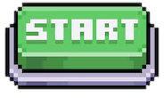
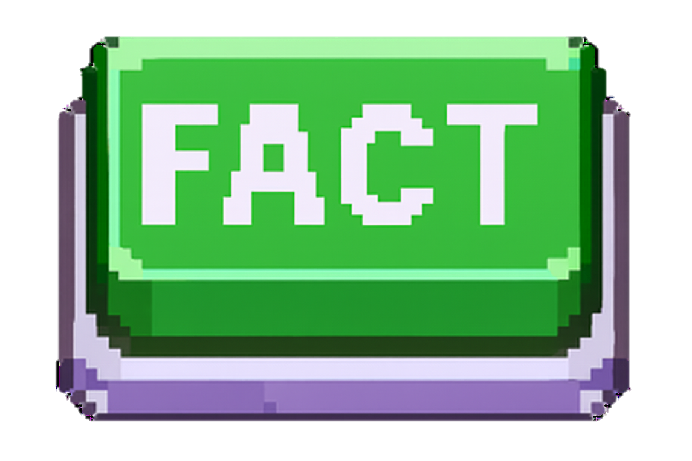
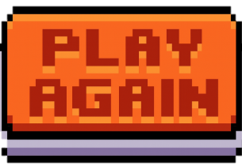
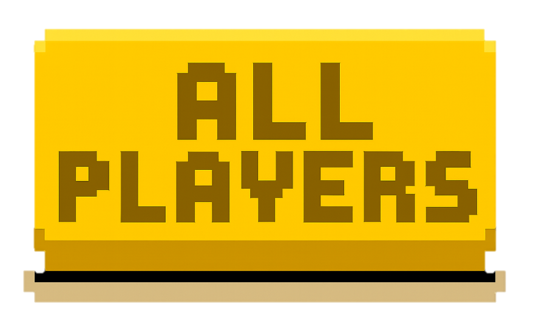

# 🎬 Fact or Fake - Video Analysis Game

Uma aplicação interativa para testar seus conhecimentos em análise de vídeos, distinguindo **fatos** de **boatos**!

## 📋 Visão Geral

**Fact or Fake** é um jogo educativo baseado em web que apresenta 10 vídeos curtos sobre temas intrigantes (OVNIs, criaturas misteriosas, fenômenos naturais) e desafia os jogadores a determinar se o conteúdo é **Fato** ou **Fake**.

Desenvolvido em **HTML5**, **CSS3** e **JavaScript vanilla**, com persistência de dados via **localStorage**.

---

## 🎮 Funcionalidades Principais

✨ **Quiz Interativo**: 10 vídeos para análise  
🏆 **Sistema de Pontuação**: Rastreamento automático de acertos  
📊 **Ranking Dinâmico**: Top 10 melhores jogadores com medalhas  
👥 **Histórico Permanente**: Registro de todos os usuários com data/hora  
🎥 **Explicações em Vídeo**: Vídeos explicativos após cada resposta  
🎨 **Interface Retrô**: Design nostálgico com animações suaves  
💾 **Dados Persistentes**: Salvamento automático via localStorage  

---

## 🎯 Fluxo do Jogo

```
1. ENTRADA → Digite seu nome
   ↓
2. ANÁLISE → Assista aos vídeos
   ↓
3. RESPOSTA → Escolha "Fato" ou "Fake"
   ↓
4. EXPLICAÇÃO → Veja a resposta correta com vídeo
   ↓
5. RESULTADO → Visualize pontuação e ranking
```

---

## 📁 Estrutura de Arquivos

```
GITHUB/FactOrFake/
├── index.html              # Estrutura HTML da aplicação
├── script.js               # Lógica do jogo e gerenciamento
├── style.css               # Estilos e animações CSS
├── .gitignore              # Arquivo Git
├── Imagens/                # Recursos visuais
│   ├── ClaytonRSouza.png
│   ├── Text-Cab.png
│   ├── B-Start.png
│   ├── B-On.png (Botão Fato)
│   ├── B-Off.png (Botão Fake)
│   ├── B-Next.png
│   ├── B-Again.png
│   ├── B-Reset.png
│   ├── B-Players.png
│   ├── Fato.png
│   ├── Fake.png
│   ├── trofeu.png
│   ├── C-Texto.png
│   └── retrogaming.gif
└── Videos/                 # Arquivos de mídia
    ├── Video1-Fake.mp4
    ├── Video1-Explicacao.mp4
    ├── Video2-Fato.mp4
    ├── Video2-Explicacao.mp4
    └── ... (10 vídeos + 10 explicações)
```

---

## 🛠️ Tecnologias Utilizadas

| Tecnologia | Versão | Uso |
|-----------|--------|-----|
| **HTML5** | - | Marcação semântica |
| **CSS3** | - | Estilos, animações e efeitos |
| **JavaScript** | ES6+ | Lógica de jogo e DOM |
| **localStorage** | - | Persistência de dados |
| **Font Awesome** | 6.4.0 | Ícones sociais |

---

## 📝 Detalhamento do Código

### 🎬 [`script.js`](script.js) - Lógica Principal

#### **Base de Dados de Vídeos**
```javascript
const videos = [
  {
    url: "videos/Video1-Fake.mp4",
    explicacaoUrl: "videos/Video1-Explicacao.mp4",
    respostaCorreta: "Fake",
    tema: "Formações em fumaças são forças de outro mundo?"
  },
  // ... 9 vídeos adicionais
];
```

#### **Variáveis Globais**
```javascript
let nome = "";              // Nome do jogador
let respostas = [];         // Array com respostas do usuário
let indice = 0;             // Índice do vídeo atual
let mostrandoExplicacao = false; // Flag para controlar estado
```

#### **Funções Principais**

##### `iniciar()`
- Captura o nome do jogador do input
- Valida se o campo não está vazio
- Esconde tela inicial
- Exibe primeira seção de quiz
- **Chamada por**: Click no botão "Start"

```javascript
function iniciar() {
  nome = document.getElementById("nome").value.trim();
  if (!nome) return alert("Enter your Name");
  document.getElementById("inicio").style.display = "none";
  document.getElementById("quiz").style.display = "block";
  carregarVideo();
}
```

##### `carregarVideo()`
- Carrega o vídeo atual da sequência
- Exibe número do vídeo (ex: "Video 1")
- Mostra tema/pergunta sobre o vídeo
- Ativa botões "Fato" e "Fake"
- **Chamada por**: `iniciar()` e `avancarVideo()`

##### `responder(resposta)`
- Registra a resposta do jogador no array
- Obtém a resposta correta do vídeo atual
- Exibe imagem "Fato" ou "Fake" rotacionada
- Carrega e toca vídeo de explicação
- Desabilita botões de resposta
- **Callback**: Onclick dos botões Fato/Fake

```javascript
function responder(resposta) {
  respostas.push(resposta);
  const videoAtual = videos[indice];
  
  // Exibe imagem correta (Fato/Fake)
  const imagem = document.getElementById("imagem-resposta");
  if (videoAtual.respostaCorreta === "Fato") {
    imagem.src = "Imagens/Fato.png";
    imagem.className = "imgfato"; // rotação 20deg
  } else {
    imagem.src = "Imagens/Fake.png";
    imagem.className = "imgfake"; // rotação -30deg
  }
  
  // Toca vídeo de explicação
  videoElement.src = videoAtual.explicacaoUrl;
  videoElement.play();
}
```

##### `avancarVideo()`
- Avança para o próximo vídeo
- Se houver próximo vídeo → `carregarVideo()`
- Se for último vídeo → `finalizar()`
- **Callback**: Onclick do botão "Next"

##### `finalizar()`
- Calcula pontuação total (acertos)
- Salva dados em localStorage
- Esconde seção quiz
- Exibe tela de resultado
- Chama `mostrarRanking()`

```javascript
function finalizar() {
  let pontos = 0;
  for (let i = 0; i < videos.length; i++) {
    if (respostas[i] === videos[i].respostaCorreta) pontos++;
  }
  
  document.getElementById("quiz").style.display = "none";
  document.getElementById("resultado").style.display = "block";
  document.getElementById("pontuacao").innerText = 
    `${nome}, you scored ${pontos} point(s)!`;
  
  salvarRanking(nome, pontos);
  mostrarRanking();
}
```

##### `salvarRanking(nome, pontos)`
Salva dados em **duas estruturas diferentes**:

**1. Ranking (pode ser zerado)**
```javascript
// localStorage["ranking"]
[
  { "nome": "Player 1", "pontos": 10 },
  { "nome": "Player 2", "pontos": 9 }
]
```

**2. Usuários (permanente)**
```javascript
// localStorage["usuarios"]
[
  {
    "nome": "Player 1",
    "pontos": 10,
    "dataHora": "25/01/2025 14:30:45"
  }
]
```

```javascript
function salvarRanking(nome, pontos) {
  // Ranking (pode ser zerado)
  let ranking = JSON.parse(localStorage.getItem("ranking")) || [];
  ranking.push({ nome, pontos });
  ranking.sort((a, b) => b.pontos - a.pontos); // Ordena decrescente
  localStorage.setItem("ranking", JSON.stringify(ranking));

  // Usuários (NUNCA apagado)
  let usuarios = JSON.parse(localStorage.getItem("usuarios")) || [];
  const dataHora = new Date().toLocaleString("pt-BR");
  usuarios.push({ nome, pontos, dataHora });
  localStorage.setItem("usuarios", JSON.stringify(usuarios));
}
```

##### `mostrarRanking()`
- Exibe Top 10 jogadores
- Atribui medalhas: 🥇 🥈 🥉
- Aplica cores personalizadas por posição
- Ordena por pontuação decrescente

```javascript
function mostrarRanking() {
  const lista = document.getElementById("ranking");
  lista.innerHTML = "";
  const ranking = JSON.parse(localStorage.getItem("ranking")) || [];

  ranking.slice(0, 10).forEach((item, index) => {
    const li = document.createElement("li");
    let medalha = "";
    let cor = "";

    if (index === 0) {
      medalha = "🥇"; cor = "#d4af37"; // Ouro
    } else if (index === 1) {
      medalha = "🥈"; cor = "#c0c0c0"; // Prata
    } else if (index === 2) {
      medalha = "🥉"; cor = "#cd7f32"; // Bronze
    }

    if (medalha) {
      li.innerHTML = `${medalha} ${index + 1}º - <strong>${item.nome}</strong> - ${item.pontos} pts`;
      li.style.color = cor;
    } else {
      li.innerText = `${index + 1}º - ${item.nome} - ${item.pontos} pts`;
    }

    lista.appendChild(li);
  });
}
```

##### `mostrarUsuarios()`
- Lista completa de TODOS os jogadores
- Inclui: Nome, pontos, data/hora
- Não pode ser resetada
- Ativa scroll automático se exceder altura

```javascript
function mostrarUsuarios() {
  const listaUsuarios = document.getElementById("lista-usuarios");
  listaUsuarios.innerHTML = "";
  const usuarios = JSON.parse(localStorage.getItem("usuarios")) || [];

  usuarios.forEach((item, index) => {
    const li = document.createElement("li");
    li.innerText = `${index + 1}º - ${item.nome} - ${item.pontos} pts - ${item.dataHora}`;
    listaUsuarios.appendChild(li);
  });

  document.getElementById("resultado").style.display = "none";
  document.getElementById("usuarios-container").style.display = "block";
}
```

##### `zerarRanking()`
- Remove apenas dados de ranking
- **Mantém** histórico de usuários
- Exibe alerta de confirmação
- Atualiza visualização

```javascript
function zerarRanking() {
  localStorage.removeItem("ranking");
  alert("Ranking Reset!");
  mostrarRanking();
}
```

##### `voltarInicio()`
- Recarrega a página
- Retorna para tela inicial

---

### 🎨 [`style.css`](style.css) - Estilos e Animações

#### **Estrutura Layout**
```css
/* Layouts principais */
.cabecalho { }   /* Logo + Texto animado */
.corpo { }       /* Área central do jogo */
.rodape { }      /* Links sociais */
```

#### **Animações Principais**

**Efeito de Digitação**
```css
@keyframes digitar {
  from { width: 0%; }
  to { width: 100%; }
}
animation: digitar 4s steps(50, end) forwards;
```

**Efeito de Piscada do Cursor**
```css
@keyframes piscar {
  50% { border-color: transparent; }
}
animation: piscar 0.7s step-end infinite;
```

#### **Efeitos Hover Interativos**

| Elemento | Classe | Efeito | Cor |
|----------|--------|--------|-----|
| Logo | `.logo` | Zoom + Brilho | Azul (#051eff) |
| Botão Fato | `.botao-Fato` | Zoom + Brilho | Verde (#15ff00) |
| Botão Fake | `.botao-Fake` | Zoom + Brilho | Vermelho (#e71d0e) |
| Botão Next | `.botao-Next` | Zoom + Brilho | Azul (#240ee7) |
| Input Nome | `.campo-nome` | Zoom + Brilho | Bronze (#bdbab1) |
| Imagem Fato | `.imgfato` | Zoom + Brilho | Verde (#15ff00) |
| Imagem Fake | `.imgfake` | Zoom + Brilho | Vermelho (#ff3f0f) |
| Troféu | `.trofeu` | Zoom + Brilho | Amarelo (#ffee00) |

```css
.botao-Fato:hover {
  transform: scale(1.2);
  filter: brightness(2.3) drop-shadow(0 0 20px #15ff00);
}
```

#### **Componentes Visuais**

**Container de Vídeos**
```css
.video-container {
  position: relative;
  display: inline-block;
}

.tema-overlay {
  position: absolute;
  top: 10px;
  left: 50%;
  transform: translateX(-50%);
  background: rgba(0, 0, 0, 0.6);
  color: #fff;
  padding: 8px 16px;
  border-radius: 6px;
  font-size: 20px;
  font-weight: bold;
}
```

**Lista de Usuários com Scroll**
```css
#usuarios-container {
  max-height: calc(70vh - 100px); /* Altura máxima */
  overflow-y: auto;                /* Scroll vertical */
  margin-bottom: 10px;
}
```

---

### 📄 [`index.html`](index.html) - Estrutura

#### **Seção 1: Início**
```html
<div id="inicio">
  <h1 class="texto-animado">Enter your Name</h1>
  <input type="text" id="nome" placeholder="Enter your Name" class="campo-nome" />
  
</div>
```

#### **Seção 2: Quiz**
```html
<div id="quiz" style="display:none;">
  <h2 id="video-titulo"></h2>
  
  <div class="video-container">
    <video id="video" width="640" controls autoplay></video>
    <div id="video-tema" class="tema-overlay"></div>
  </div>

  <div id="botoes">
    
    
  </div>
  
  <div id="explicacao-controles" style="display:none;">
    
    
  </div>
</div>
```

#### **Seção 3: Resultado**
```html
<div id="resultado" style="display:none;">
  <h2>Final Result</h2>
  <div class="trofeu-container">
    
  </div>
  <p id="pontuacao"></p>
  <h3>Ranking</h3>
  <ul id="ranking"></ul>
  
  
  
</div>
```

#### **Seção 4: Lista de Usuários**
```html
<div id="usuarios-container" style="display:none;">
  <h2>User list</h2>
  <ul id="lista-usuarios"></ul>
</div>
```

---

## 💾 Sistema de Persistência

### **localStorage**

A aplicação usa localStorage para armazenar dois tipos de dados:

#### **1. Ranking (pode ser zerado)**
```javascript
localStorage.getItem("ranking")
// Resultado:
[
  { "nome": "Clayton", "pontos": 10 },
  { "nome": "Maria", "pontos": 9 },
  { "nome": "João", "pontos": 8 }
]
```

#### **2. Usuários (permanente)**
```javascript
localStorage.getItem("usuarios")
// Resultado:
[
  {
    "nome": "Clayton",
    "pontos": 10,
    "dataHora": "25/01/2025 14:30:45"
  },
  {
    "nome": "Maria",
    "pontos": 9,
    "dataHora": "25/01/2025 14:25:10"
  }
]
```

**Diferenças Importantes:**
- ✅ Ranking: Pode ser zerado pelo botão "B-Reset"
- ✅ Usuários: Nunca é apagado (histórico completo)
- ✅ Data/Hora: Somente salva em usuários

---

## 🎬 Conteúdo dos 10 Vídeos

| # | Tema | Resposta | Arquivo | Explicação |
|---|------|----------|---------|-----------|
| 1 | Formações em fumaças são forças? | **Fake** | Video1-Fake.mp4 | Video1-Explicacao.mp4 |
| 2 | Pedra da Somália é meteorito? | **Fato** | Video2-Fato.mp4 | Video2-Explicacao.mp4 |
| 3 | Luzes no céu do México são OVNIs? | **Fato** | Video3-Fato.mp4 | Video3-Explicacao.mp4 |
| 4 | Criatura é Chupa Cabra? | **Fake** | Video4-Fake.mp4 | Video4-Explicacao.mp4 |
| 5 | Espelhos são portais? | **Fake** | Video5-Fake.mp4 | Video5-Explicacao.mp4 |
| 6 | Carpa tem traços humanos? | **Fato** | Video6-Fato.mp4 | Video6-Explicacao.mp4 |
| 7 | Câmera captura fantasma? | **Fake** | Video7-Fake.mp4 | Video7-Explicacao.mp4 |
| 8 | Tema livre | **Fato** | video8.mp4 | explicacao8.mp4 |
| 9 | Tubarão bebê mutante? | **Fato** | Video9-Fato.mp4 | Video9-Explicacao.mp4 |
| 10 | Naves alienígenas? | **Fake** | Video10-Fake.mp4 | Video10-Explicacao.mp4 |

---

## 📊 Sistema de Pontuação

```
Total: 10 videos
Acerto: +1 ponto
Erro: +0 pontos

Pontuação máxima: 10 pontos

Ranking:
🥇 1º lugar: Ouro (#d4af37)
🥈 2º lugar: Prata (#c0c0c0)
🥉 3º lugar: Bronze (#cd7f32)
```

**Exemplo:**
```
Clayton respondeu 8 videos corretamente
Pontuação: 8/10 pontos
Posição no ranking: Calculada automaticamente
```

---

## 🎨 Características Visuais

✨ **Tema Retrô**: Inspiração em jogos dos anos 80/90  
✨ **Animações Suaves**: Transições e efeitos hover fluidos  
✨ **Responsive Design**: Adaptável a diferentes resoluções  
✨ **Acessibilidade**: Texto alternativo em todas as imagens  
✨ **Paleta de Cores**:
- Verde: #15ff00 (Fato)
- Vermelho: #e71d0e (Fake)
- Azul: #240ee7 (Next)
- Ouro: #d4af37 (1º lugar)
- Prata: #c0c0c0 (2º lugar)
- Bronze: #cd7f32 (3º lugar)

---

## 🐛 Notas Técnicas

- ✅ Utiliza **ES6+** (arrow functions, const/let, template literals)
- ✅ **localStorage** como banco de dados local (sem backend)
- ✅ Sem dependências externas (vanilla JavaScript puro)
- ✅ Font Awesome CDN para ícones sociais
- ✅ Video HTML5 nativo com controles
- ✅ Responsivo e otimizado para desktop

---

## 🔧 Troubleshooting

### Vídeos não carregam
- Verifique se os arquivos estão em `Videos/`
- Verifique os nomes dos arquivos (case-sensitive)

### Cache do navegador
- Limpe cache: `Ctrl + Shift + Delete`
- Ou use `Ctrl + Shift + R` para reload forçado

### localStorage não funciona
- Desabilite modo privado/incógnito
- Verifique se o navegador permite localStorage

---

## 👤 Desenvolvedor

**Clayton Rodrigues Souza**

### 🔗 Links Sociais
- 💼 [LinkedIn](https://www.linkedin.com/in/clayton-rodrigues-souza-5276b875)
- 💻 [GitHub](https://github.com/ClaytonSouza-Tec/lab-fact-or-fake)
- 📚 [Udemy](https://www.udemy.com/user/clayton-souza-4/)

---

## 📄 Licença

© 2025 CRSouza. Todos os direitos reservados.

Desenvolvido com ❤️ para educação e entretenimento.

---

## ⭐ Agradecimentos

Obrigado por jogar! Se curtiu, deixe uma ⭐ no GitHub!
